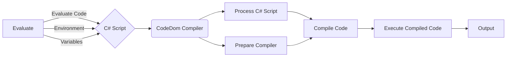

# SharpEvaluate .NET Framework

This is a library that allows you to **Evaluate** code during *runtime*. This allows you to run unsafe code whilst during *runtime*. This can make importing variables from external applications quicker. **SharpEvaluate** is based of javascript ```eval()``` function.  

**SharpEvaluate** allows a pass-through of variables to makes evaluating code easier and smarter. Similar projects like **SharpEvaluate** like [ExpressionEvaluator](https://github.com/datchung/ExpressionEvaluator) by [datchung](https://github.com/datchung/) - ExpressionEvaluator uses a way of understanding written syntax to understand what it needs to evaluate. Another **evaluation** example is [C# Eval Expression](https://eval-expression.net/) this is a library that uses most complex and simple ways to **evaluate** code during *runtime*

## How does it work?
The **SharpEvaluate** Evaluator works by using [Microsoft's CodeDom Compiler](https://docs.microsoft.com/en-us/dotnet/api/system.codedom.compile), The program starts by laying out all the included **variables** and converting them into **C#** code. The program the starts to build a script based around the local environment where the *function* was called, using gathered infomation like the ***method's namespaces*** and the ***method's class***. The program then makes a **method** of which the included **variables** will be imported into code along with the **evaluate code** will be placed. The program then builds a [CSharpCodeProvider  Class](https://docs.microsoft.com/en-us/dotnet/api/microsoft.csharp.csharpcodeprovider?view=net-5.0) this is the [Microsoft CodeDom Compiler](https://docs.microsoft.com/en-us/dotnet/api/system.codedom.compile) The program then **compiles** & **executes** code. Returning the result to the **caller method**.

## Getting started with **SharpEvaluate**
- Head over to the **SharpEvaluate** project [Release page](https://github.com/DressyLemon/SharpEvaluate/releases) and source the lastest version of **SharpEvalute** *downloading pre-releases versions may include bugs*.
- Now using [Visual Studio](https://visualstudio.microsoft.com/) import the referenced **SharpEvalute** **.dll* that you downloaded from the [Release page](https://github.com/DressyLemon/SharpEvaluate/releases)  into your *project.*


Now you can use the example code below inside of your project to start **evaluating** code during *runtime*

```csharp
using System;
using Evaluator
namespace Example
{
    class Program
    {
        class foo
        {
            public int A { get; set; }
            public int B { get; set; }
        }
        static void Main(string[] args)
        {
            
            foo example = new foo();
            example.A = 5;
            example.B = 10;
            Console.WriteLine(
                string.Join(",",
                    Evaluate.eval<int>("return A+B; ", example).ToString()
                )
            );
            Console.ReadKey();
        }
    }
}
```

